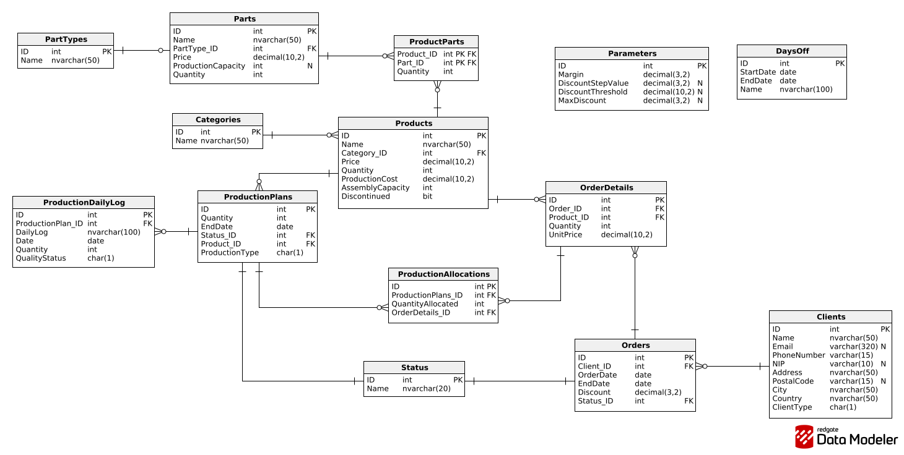

# Supply Chain Database (SQL Server)

Projekt relacyjnej bazy danych obsługującej procesy produkcyjne, magazynowe oraz sprzedażowe. System symuluje działanie małego systemu ERP/MRP z naciskiem na automatyzację logiki biznesowej po stronie serwera SQL.

## Autorzy
- **Patrycja Zborowska**
- **Alicja Czeleń**
- **Piotr Sączawa**

---

##  Kluczowe funkcjonalności

Projekt implementuje scenariusze biznesowe:

### 1. Inteligentne Zarządzanie Zamówieniami (`AddOrder`)
- Transakcyjne składanie zamówień z obsługą **koszyka produktów** (Typ tabelaryczny).
- Automatyczna weryfikacja stanów magazynowych.
- W przypadku braku towaru: **automatyczne generowanie planów produkcyjnych** (On-demand) i obliczanie realnego terminu dostawy na podstawie mocy przerobowych.
- Dynamiczny system rabatowy konfigurowalny przez parametry globalne.

### 2. Obsługa Produkcji i Awarii (`Quality Failure Handling`)
- Unikalny algorytm **planów produkcyjnych**: w przypadku błędu jakościowego (odrzutu), system automatycznie pobiera brakujące sztuki z planów cyklicznych (na magazyn), aby uratować termin zamówienia klienta.
- Jeśli "podkradanie" jest niemożliwe, system tworzy plan awaryjny i powiadamia o opóźnieniu.

### 3. Analityka i Raportowanie
- Widoki zoptymalizowane pod raporty zarządcze (sprzedaż, koszty produkcji, bestsellery).
- System uprawnień (Role: Zarząd, Sprzedaż, Planista, Magazyn).

---

## Technologie
- **Silnik:** MS SQL Server (T-SQL)
- **Elementy:**
  - Procedury Składowane (z obsługą transakcji `BEGIN TRAN` / `ROLLBACK`)
  - Wyzwalacze (Triggers)
  - Funkcje skalarne i tabelaryczne
  - Widoki (Views)
  - Typy tabelaryczne (User-Defined Table Types)

## Struktura Bazy Danych

  

## Jak uruchomić?
1. Otwórz **SQL Server Management Studio (SSMS)**.
2. Uruchom skrypt `script.sql` (tworzy strukturę, widoki i procedury).

---
*Projekt realizowany w ramach przedmiotu Podstawy Baz Danych (2025/2026).*
