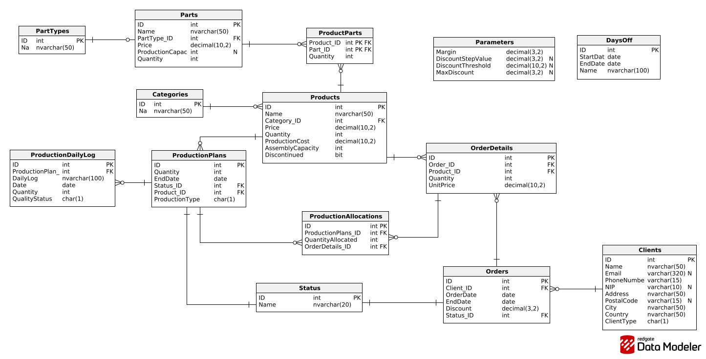

# Podstawy Baz danych

Dzień i godzina zajęć: **środa 13:15**

Nr zespołu: **7**

Autorzy:

- **Patrycja Zborowska**
- **Alicja Czeleń**
- **Piotr Sączawa**

---

# 1. Wymagania i funkcje systemu

##

### Zarządzanie produktami

- Rejestracja produktów i ich kategorii.
- Definicja struktury produktu (lista części i robocizny).
- Obliczanie kosztu i mocy przerobowej.

### Zarządzanie magazynem

- Rejestracja części i stanów magazynowych.
- Rejestracja stanów magazynowych produktów gotowych.
- Aktualizacja stanów magazynowych przy sprzedaży i produkcji.
- Rejestracja planów produkcji.

### Planowanie produkcji

- Ustalanie zapotrzebowania na podstawie zamówień.
- Sprawdzanie dostępności surowców.
- Szacowanie czasu produkcji w oparciu o moce przerobowe.
- Tworzenie planu produkcji produktów brakujących w magazynie.

### Zarządzanie zamówieniami

- Składanie zamówień przez klientów indywidualnych i firmowych.
- Obsługa płatności.
- Możliwość dodania jednostkowego rabatu.
- Sprawdzenie dostępności produktów w magazynie.
- Obsługa zamówień wymagających produkcji.

### Raportowanie (analityka danych)

- Raporty kosztów produkcji: jednostkowe, grup produktowych; kwartalne/miesięczne/roczne.
- Raporty stanów magazynowych (produkty i surowce) oraz planów produkcji.
- Raporty zamówień klientów (także z rabatami) z opcją filtrowania po okresach czasu.
- Raporty sprzedaży grup produktów (miesiące i tygodnie).
- Raport kosztów produkcji w ujęciu tygodniowym i miesięcznym.
- Raporty planów wytwórczych w wybranych okresach.

### Narzędzia bazy danych

- Procedury, funkcje (np. obliczanie kosztów).
- Triggery aktualizujące stany.
- Widoki analityczne do raportów.

## Use cases:

### UC1: Rejestracja produktu

**Aktor:** Administrator / Planista produkcji
**Cel:** Dodanie nowego produktu do systemu.
**Wyzwalacz:** Potrzeba wprowadzenia nowego produktu.

#### Główny przebieg:

- Aktor wybiera opcję „Dodaj produkt”.
- Wprowadza dane: nazwę produktu, kategorię, cenę, parametry techniczne, listę części.
- System waliduje dane.
- System zapisuje produkt w bazie.

---

### UC2: Obliczenie kosztu produkcji

**Aktor:** Planista produkcji
**Cel:** Wyliczenie jednostkowego kosztu produktu.
**Dane wejściowe:** ID produktu.

#### Główny przebieg:

- Planista wybiera produkt.
- System pobiera listę części i ich koszty.
- System sumuje koszty materiałów i pracy.
- System wyświetla jednostkowy koszt produkcji.

---

### UC3: Sprawdzenie dostępności magazynowej

**Aktor:** Magazynier / System produkcji
**Cel:** Zweryfikowanie dostępności produktu lub jego części.
**Dane wejściowe:** ID produktu.

#### Główny przebieg:

- Aktor lub system inicjuje sprawdzenie stanu magazynowego.
- System pobiera stany magazynowe produktu oraz wymaganych części.
- System określa poziom dostępności.

#### Wynik:

- „dostępny”
- „brak części”
- „brak produktu”

---

### UC4: Złożenie zamówienia

**Aktor:** Klient / Dział sprzedaży
**Cel:** Zarejestrowanie zamówienia w systemie.

#### Główny przebieg:

- Klient wybiera produkty.
- System sprawdza dostępność magazynową.
- System nalicza rabaty, jeśli obowiązują.
- System wylicza całkowity koszt zamówienia.
- System zapisuje zamówienie.

---

### UC5: Planowanie produkcji

**Aktor:** Planista produkcji
**Cel:** Utworzenie planu produkcji.

#### Główny przebieg:

- System pobiera zamówienia wymagające produkcji.
- System analizuje dostępność części zamówienia.
- System określa wymagany czas produkcji.
- Planista zatwierdza plan.

---

### UC6: Realizacja produkcji

**Aktor:** Pracownik produkcji / System produkcji
**Cel:** Zrealizowanie procesu produkcyjnego.

#### Główny przebieg:

- System generuje zapotrzebowanie na części.
- Magazyn wydaje części i aktualizuje stany magazynowe.
- Produkcja wytwarza produkt.
- System rejestruje produkt gotowy w magazynie.

---

### UC7: Generowanie raportów

**Aktor:** Zarząd / Analityk
**Cel:** Analiza danych produkcyjnych, magazynowych i sprzedażowych.

#### Rodzaje raportów:

- koszty produkcji (wg okresów),
- stany magazynowe,
- zamówienia klientów,
- sprzedaż tygodniowa/miesięczna,
- plany i realizacja produkcji.

#### Główny przebieg:

- Aktor wybiera typ raportu oraz zakres dat.
- System pobiera wymagane dane.
- System generuje raport i udostępnia go do wglądu lub eksportu.

---

<br>

## Diagram przypadków użycia

<p align="center">
  
</p>

# 2. Baza danych

## Schemat bazy danych

<p align="center">
  
</p>

## Opis poszczególnych tabel

[TODO: #3 Dla każdej tabeli kod DDL wraz z zaimplementowanymi war. integralności, + ewentualnie opis, np. w formie tabelki]: #

### Kategorie produktów

```SQL
CREATE TABLE dbo.Categories (
    ID int  NOT NULL IDENTITY,
    Name nvarchar(50)  NOT NULL,
    CONSTRAINT PK_Categories PRIMARY KEY CLUSTERED (ID)
);
```

- tabela pozwalająca przypisać kategorię danego produktu (np. jeśli dany produkt to krzesło to należy do kategorii "meble")

### Klienci

```SQL
CREATE TABLE dbo.Clients (
    ID int  NOT NULL IDENTITY,
    Name nvarchar(50)  NOT NULL,
    Email varchar(320)  NULL,
    PhoneNumber varchar(15)  NOT NULL,
    NIP varchar(10)  NULL,
    Address nvarchar(50)  NOT NULL,
    PostalCode nvarchar(50)  NULL,
    City nvarchar(50)  NOT NULL,
    Country nvarchar(50)  NOT NULL,
    ClientType char(1)  NOT NULL,
    CONSTRAINT PK_Clients PRIMARY KEY CLUSTERED (ID)
);
```

- tabela zawierająca dane klientów składających zamówienia(nazwę klienta, dane kontaktowe- nr telefonu + email opcjonalnie, NIP - opcjonalnie, dane adresowe oraz typ klienta- 'I' jeśli to klient indywidualny, 'F' jeśli to firma)

### Dni bez pracy/produkcji

```SQL
CREATE TABLE dbo.DaysOff (
    ID int  NOT NULL IDENTITY,
    StartDate date  NOT NULL,
    EndDate date  NOT NULL,
    Name nvarchar(100)  NOT NULL,
    CONSTRAINT DaysOff_pk PRIMARY KEY (ID)
);
```

- tabela zawierająca przedziały czasowe, w których nie odbywała się produkcja (dni wolne lub przerwy techniczne spowodowane awarią) wraz z krótkim opisem przyczyny zawieszenia produkcji

### Szczegóły zamówienia

```SQL
CREATE TABLE dbo.OrderDetails (
    Order_ID int  NOT NULL,
    Product_ID int  NOT NULL,
    Quantity int  NOT NULL,
    UnitPrice decimal(10,2)  NOT NULL,
    CONSTRAINT PK_OrderDetails PRIMARY KEY CLUSTERED (Order_ID,Product_ID)
);
```

- tabela łącznikowa pomiędzy produktami a zamówieniami, zawiera informacje na temat ilości zamawianego produktu w danym zamówieniu oraz o cenie jednostkowej tego produktu

### Zamówienia

```SQL
CREATE TABLE dbo.Orders (
    ID int  NOT NULL IDENTITY,
    Client_ID int  NOT NULL,
    Status_ID int  NOT NULL,
    OrderDate date  NOT NULL,
    EndDate date  NOT NULL,
    Discount decimal(3,2)  NOT NULL DEFAULT 0,
    CONSTRAINT PK_Orders PRIMARY KEY CLUSTERED (ID)
);
```

- tabela zawierająca informacje na temat zamówień (nazwa klienta zamawiającego, datę zamówienia, datę zakończenia zamówienia - skompletowane zamówienie przygotowane do wysyłki, status zamówienia- "w trakcie produkcji", "skończone" oraz rabat jednostkowy przyznawany do zamówienia)

### Kategorie części

```SQL
CREATE TABLE dbo.PartTypes (
    ID int  NOT NULL IDENTITY,
    Name nvarchar(50)  NOT NULL,
    CONSTRAINT PK_PartTypes PRIMARY KEY CLUSTERED (ID)
);
```

- tabela pozwalająca przypisać kategorię danej częsci (np. jeśli dana część to śruba należy do kategorii "metal")

### Części

```SQL
CREATE TABLE dbo.Parts (
    ID int  NOT NULL IDENTITY,
    Name nvarchar(50)  NOT NULL,
    PartType_ID int  NOT NULL,
    Price decimal(10,2)  NOT NULL,
    ProductionCapacity int  NULL,
    Quantity int  NOT NULL DEFAULT 0,
    CONSTRAINT PK_Parts PRIMARY KEY CLUSTERED (ID)
);
```

- tabela zaierająca informacje na temat części (nazwę danej części, połączenie z kategorią do której należy, cenę danej części, moc przerobową- ile części danego typu jesteśmy w stanie wyprodukować jednego dnia, ilość jaka obecnie jest w magazynie)

### Części danego produktu (łącznikowa)

```SQL
CREATE TABLE dbo.ProductParts (
    Product_ID int  NOT NULL,
    Part_ID int  NOT NULL,
    Quantity int  NOT NULL,
    CONSTRAINT PK_ProductParts PRIMARY KEY CLUSTERED (Product_ID,Part_ID)
);
```

- tabela łącznikowa pomiędzy produktem a częściami z jakich się składa, zawiera informację ile części danego typu jest potrzebne do złożenia danego produktu

### Zarezerwowanie produkowanych rzeczy do konkretnego zamówienia

```SQL
CREATE TABLE dbo.ProductionAllocations (
    ID int  NOT NULL IDENTITY,
    ProductionPlans_ID int  NOT NULL,
    QuantityAllocated int  NOT NULL,
    Orders_ID int  NOT NULL,
    CONSTRAINT ProductionAllocations_pk PRIMARY KEY  (ID)
);
```

- tabela pozwalająca na zarezerwowanie produktów będących w trakcie produkcji do konkretnego zamówienia (z danego planu produkcji możemy zarezerwować konkretną ilość, którą wykorzystamy do danego zamówienia)

### Dzienne sprawozdanie z wykonywania planu produkcyjnego

```SQL
CREATE TABLE dbo.ProductionDailyLog (
    ID int  NOT NULL IDENTITY,
    ProductionPlan_ID int  NOT NULL,
    DailyLog nvarchar(50)  NOT NULL,
    Date date  NOT NULL,
    Quantity int  NOT NULL,
    QualityStatus char(1)  NOT NULL,
    CONSTRAINT ProductionDailyLog_pk PRIMARY KEY  (ID)
);
```

- tabela pozwalająca uzyskać informacje na temat planów produkcyjnych w danym dniu (dla konkretnego planu produkcyjnego w danym dniu zawiera informację o ilości produktu, którą udało się wyprodukować, informację o tym czy produkcja się udała lub jeśli się nie udała to powód- zapisane w DailyLog (oraz w QualityStatus sam efekt końcowy - 'K' udana produkcja, 'F' nie udana produkcja)

### Plany produkcyjne (cykliczne bądź wymuszone popytem)

```SQL
CREATE TABLE dbo.ProductionPlans (
    ID int  NOT NULL IDENTITY,
    Quantity int  NOT NULL,
    EndDate date  NOT NULL,
    Status char(1)  NOT NULL,
    Product_ID int  NOT NULL,
    ProductionType char(1)  NOT NULL,
    CONSTRAINT PK_ProductionPlans PRIMARY KEY CLUSTERED (ID)
);
```

- tabela zaplanowanych produkcji pozwalająca sprawdzić dostępność danego produktu na konkretny dzień, zawiera informacje o każdej produkcji (produkt i jego ilość produkowanych w danej produkcji, status produkcji -'R'- zrealizowane, 'P'- w trakcie, datę zakończenia danej produkcji, typ produkcji - czy zamowienie jest cykliczne(wypełnianie magazynu tak żeby produkty byly dostepne) - 'C', czy zamowienie jest robione pod zamowienie (klient zamowil ale brakuje w magazynie ) - 'O')

### Produkty

```SQL
CREATE TABLE dbo.Products (
    ID int NOT NULL IDENTITY,
    Name nvarchar(50) NOT NULL,
    Category_ID int NOT NULL,
    Quantity int NOT NULL DEFAULT 0,
    AssemblyCapacity int NULL,

    ProductionCost AS ([dbo].[ObliczKosztProdukcji]([ID])),
    Price AS ([dbo].[ObliczKosztProdukcji]([ID]) * 1.5),

    CONSTRAINT
        PK_Products PRIMARY KEY CLUSTERED (ID),
    CONSTRAINT
        FK_Products_Categories FOREIGN KEY (Category_ID)
            REFERENCES dbo.Categories(ID)
);
```

- tabela zawierająca informacje na temat produktów (nazwę, kategorię do jakiej należy, ilość jaka obecnie jest w magazynie, moc przerobową- maksymalna ilość jaką możemy wyprodukować w ciągu jednego dnia, koszt produkcji oraz cenę)
- kolumny ProductionCost i Price wyliczane funkcją poniżej

### Statusy zamówień

```SQL
CREATE TABLE dbo.Status (
    ID int  NOT NULL IDENTITY,
    Name nvarchar(50)  NOT NULL,
    CONSTRAINT PK_Status PRIMARY KEY CLUSTERED (ID)
);
```

- tabela pozwalająca określić jaki status ma konkretne zamówienie- "w trakcie kopmletowania" lub "skończone"

## Zaawansowane więzy integralności (Ograniczenia)

### Zabezpieczenie parametrów finansowych (Tabela Parameters)

```SQL
ALTER TABLE Parameters
    ADD CONSTRAINT CK_Parameters_Values
        CHECK (Margin >= 0 AND DiscountStepValue >= 0);
```

- Opis: Constraint ten pełni rolę bezpiecznika dla logiki biznesowej systemu. Blokuje możliwość wprowadzenia ujemnej marży (`Margin`) oraz ujemnego skoku rabatowego (`DiscountStepValue`). Dzięki temu zapobiegamy sytuacjom, w których system mógłby wyliczać błędne, ujemne ceny sprzedaży lub naliczać "odwrotne" rabaty dopłacające klientowi.

### Zaawansowana walidacja adresu e-mail (Tabela Clients)

```SQL
ALTER TABLE Clients
    ADD CONSTRAINT CK_Clients_EmailValid
        CHECK (
            Email NOT LIKE '% %'
                AND LEN(Email) - LEN(REPLACE(Email, '@', '')) = 1
                AND PATINDEX('%_@_%._%', Email) > 0
                AND LEN(RIGHT(Email, CHARINDEX('.', REVERSE(Email)) - 1)) >= 2
            );
```

- Opis: Ze względu na brak obsługi wyrażeń regularnych (Regex) w standardowych constraintach SQL Server, zastosowano kombinację funkcji tekstowych do weryfikacji formatu e-maila:
1. `Email NOT LIKE '% %'` – adres nie może zawierać spacji.
2. `LEN... - LEN(REPLACE...) = 1` – adres musi zawierać dokładnie jeden znak `@`.
3. `PATINDEX` – sprawdza strukturę: ciąg znaków -> `@` -> ciąg znaków -> `.` -> ciąg znaków.
4. `LEN(RIGHT...) >= 2` – weryfikuje, czy domena najwyższego poziomu (np. .pl, .com) ma co najmniej 2 znaki.

### Wymagalność danych kontaktowych (Tabela Clients)

```SQL
ALTER TABLE Clients
    ADD CONSTRAINT CK_Clients_AtLeastOneContact
        CHECK (
            Email IS NOT NULL OR PhoneNumber IS NOT NULL
            );
```

- Opis: Więzy te realizują wymaganie biznesowe mówiące, że z każdym klientem musi być możliwy kontakt. System nie pozwala na dodanie klienta, który nie ma podanego ani adresu e-mail, ani numeru telefonu. Pola te mogą być NULL-ami, ale nie oba jednocześnie.

<!-- - Opis:

| Nazwa atrybutu | Typ | Opis/Uwagi |
| :------------: | :-: | :--------: | --- |
|   Atrybut 1    |     |            |
|   Atrybut 2    |     |            |
|   Atrybut 3    |     |            | -->


# 3. Widoki, procedury i funkcje

## Widoki

### vw_OrdersSummary

```SQL
CREATE OR ALTER VIEW vw_OrdersSummary AS
WITH CartValue AS (
    -- KROK 1: Pobranie wartości koszyka dla każdego zamówienia
    SELECT
        ID AS Order_ID,
        dbo.PobierzWartoscKoszyka(ID) AS SumValue
    FROM Orders
),
DiscountPercent AS (
    -- KROK 2: Wyliczenie procentu rabatu funkcją skalarną
    SELECT
        o.ID AS OrderID,
        o.Client_ID,
        o.OrderDate,
        ISNULL(cv.SumValue, 0.00) AS Base,
        dbo.ObliczZnizke(ISNULL(cv.SumValue, 0.00)) AS Discount
    FROM Orders o
    JOIN CartValue cv ON o.ID = cv.Order_ID
)
-- KROK 3: Ostateczne zestawienie finansowe
SELECT
    OrderID,
    Client_ID,
    OrderDate,
    CAST(Base AS DECIMAL(18,2)) AS BaseValue,
    Discount AS DiscountPercent,
    CAST(Base * Discount AS DECIMAL(18,2)) AS DiscountValue,
    CAST(Base * (1.00 - Discount) AS DECIMAL(18,2)) AS FinalValue
FROM DiscountPercent;
```

- Opis: Widok agregujący dane finansowe zamówień. Oblicza wartość bazową koszyka, naliczony procent rabatu, wartość rabatu oraz ostateczną kwotę do zapłaty.

## Procedury/funkcje

### ObliczKosztProdukcji

```sql
CREATE FUNCTION dbo.ObliczKosztProdukcji (@ProductId INT)
    RETURNS DECIMAL(10,2)
AS
BEGIN
    DECLARE @Koszt DECIMAL(10,2);

    -- Sumujemy (Cena Części * Ilość Części w Produkcie)
    SELECT @Koszt = SUM(p.Price * pp.Quantity)
    FROM Parts p
             JOIN ProductParts pp ON p.ID = pp.Part_ID
    WHERE pp.Product_ID = @ProductId;

    -- Zwracamy 0 jeśli brak części, w przeciwnym razie wyliczoną sumę
    RETURN ISNULL(@Koszt, 0);
END
```

- Opis: Funkcja obliczająca koszt produkcji danego produktu na podstawie ilości i ceny jego części.

### ObliczCeneSprzedaży

```SQL
CREATE FUNCTION dbo.ObliczCeneSprzedazy (@ProductId INT)
    RETURNS DECIMAL(10,2)
AS
BEGIN
    DECLARE @KosztBazowy DECIMAL(10,2);
    DECLARE @Mnoznik DECIMAL(10,2);

    -- 1. Pobieramy czysty koszt
    SET @KosztBazowy = dbo.ObliczKosztProdukcji(@ProductId);

    -- 2. Pobieramy marżę z tabeli Parameters (np. 1.50)
    SELECT TOP 1 @Mnoznik = Margin FROM Parameters;
    SET @Mnoznik = ISNULL(@Mnoznik, 1.50);

    -- 3. Zwracamy wynik
    RETURN @KosztBazowy * @Mnoznik;
END
```

- Opis: Funkcja ustala cenę na podstawie kosztu produkcji i marży z tabeli `Parameters`.

### PobierzWartoscKoszyka

```SQL
CREATE FUNCTION dbo.PobierzWartoscKoszyka (@OrderId INT)
    RETURNS DECIMAL(18, 2)
AS
BEGIN
    DECLARE @Suma DECIMAL(18, 2);

    SELECT @Suma = SUM(Quantity * UnitPrice)
    FROM OrderDetails
    WHERE Order_ID = @OrderId;

    RETURN ISNULL(@Suma, 0.00);
END
```

- Opis: Funkcja pomocnicza sumująca pozycje zamówienia.

### ObliczZnizke

```SQL
CREATE OR ALTER FUNCTION dbo.ObliczZnizke (@WartoscZamowienia DECIMAL(18, 2))
    RETURNS DECIMAL(4, 2)
AS
BEGIN
    DECLARE @Prog DECIMAL(18, 2);
    DECLARE @SkokProcent DECIMAL(4, 2);
    DECLARE @MaxProcent DECIMAL(4, 2);
    DECLARE @KwotaSkoku DECIMAL(18, 2) = 100.00;
    DECLARE @WyliczonaZnizka DECIMAL(4, 2);

    -- Pobieramy ustawienia z tabeli Parameters
    SELECT TOP 1
        @Prog = DiscountThreshold,
        @SkokProcent = DiscountStepValue,
        @MaxProcent = MaxDiscount
    FROM Parameters;

    SET @Prog = ISNULL(@Prog, 999999.00);
    SET @MaxProcent = ISNULL(@MaxProcent, 0.00);

    -- Jeśli kwota <= próg, brak zniżki
    IF @WartoscZamowienia <= @Prog
        RETURN 0.00;

    -- Obliczenia skokowe
    DECLARE @Nadwyzka DECIMAL(18, 2) = @WartoscZamowienia - @Prog;
    DECLARE @IloscKrokow INT = CAST(CEILING(@Nadwyzka / @KwotaSkoku) AS INT)
    SET @WyliczonaZnizka = @IloscKrokow * @SkokProcent;

    -- Blokada MAX
    IF @WyliczonaZnizka > @MaxProcent
        SET @WyliczonaZnizka = @MaxProcent;

    RETURN @WyliczonaZnizka;
END;
```

- Opis: Funkcja oblicza rabat w zależności od wartości zamówienia (logika progowa).


# 4. Role i Uprawnienia

Zastosowano model **Role-Based Access Control (RBAC)**.

### Definicja Ról

```SQL
-- Rola dla Zarządu i Analityków (tylko podgląd raportów)
CREATE ROLE [Rola_Zarzad];

-- Rola dla Działu Sprzedaży (obsługa klientów i zamówień)
CREATE ROLE [Rola_Sprzedaz];

-- Rola dla Planisty Produkcji (planowanie, definicja produktów)
CREATE ROLE [Rola_Planista];

-- Rola dla Magazyniera / Pracownika Produkcji (realizacja, stany magazynowe)
CREATE ROLE [Rola_Magazyn];
```

### Przypisanie uprawnień

```SQL
-- 1. Zarząd: tylko odczyt
GRANT SELECT ON SCHEMA::dbo TO [Rola_Zarzad];

-- 2. Dział Sprzedaży: Klienci i Zamówienia (Pełny dostęp)
GRANT SELECT, INSERT, UPDATE, DELETE ON Clients TO [Rola_Sprzedaz];
GRANT SELECT, INSERT, UPDATE, DELETE ON Orders TO [Rola_Sprzedaz];
GRANT SELECT, INSERT, UPDATE, DELETE ON OrderDetails TO [Rola_Sprzedaz];
GRANT SELECT ON Status TO [Rola_Sprzedaz];
-- Podgląd produktów (żeby sprawdzić dostępność), ale bez edycji
GRANT SELECT ON Products TO [Rola_Sprzedaz];
GRANT SELECT ON Categories TO [Rola_Sprzedaz];

-- 3. Planista: Produkty i Plany
GRANT SELECT, INSERT, UPDATE, DELETE ON Products TO [Rola_Planista];
GRANT SELECT, INSERT, UPDATE, DELETE ON Categories TO [Rola_Planista];
GRANT SELECT, INSERT, UPDATE, DELETE ON ProductParts TO [Rola_Planista];
GRANT SELECT, INSERT, UPDATE, DELETE ON Parameters TO [Rola_Planista];
GRANT SELECT, INSERT, UPDATE, DELETE ON ProductionPlans TO [Rola_Planista];
GRANT SELECT, INSERT, UPDATE, DELETE ON ProductionAllocations TO [Rola_Planista];
GRANT SELECT, INSERT, UPDATE, DELETE ON DaysOff TO [Rola_Planista];
GRANT EXECUTE ON OBJECT::dbo.ObliczKosztProdukcji TO [Rola_Planista];

-- 4. Magazyn: Części i Logi
GRANT SELECT, INSERT, UPDATE, DELETE ON Parts TO [Rola_Magazyn];
GRANT SELECT, INSERT, UPDATE, DELETE ON PartTypes TO [Rola_Magazyn];
GRANT SELECT, INSERT, UPDATE, DELETE ON ProductionDailyLog TO [Rola_Magazyn];
-- Aktualizacja stanu gotowych produktów (tylko ilość, bez zmiany cen/nazw)
GRANT UPDATE (Quantity) ON Products TO [Rola_Magazyn];
```

### Przykładowi użytkownicy
```SQL
-- 1. Użytkownik dla Zarządu
CREATE USER [User_Analityk] WITHOUT LOGIN;
ALTER ROLE [Rola_Zarzad] ADD MEMBER [User_Analityk];

-- 2. Użytkownik dla Sprzedaży
CREATE USER [User_Sprzedawca] WITHOUT LOGIN;
ALTER ROLE [Rola_Sprzedaz] ADD MEMBER [User_Sprzedawca];

-- 3. Użytkownik dla Planowania
CREATE USER [User_Planista] WITHOUT LOGIN;
ALTER ROLE [Rola_Planista] ADD MEMBER [User_Planista];

-- 4. Użytkownik dla Magazynu
CREATE USER [User_Magazynier] WITHOUT LOGIN;
ALTER ROLE [Rola_Magazyn] ADD MEMBER [User_Magazynier];
```


<!-- ## Triggery

(dla każdego triggera należy wkleić kod polecenia definiującego trigger wraz z komentarzem)

```sql
-- ...
```


(informacja o sposobie wygenerowania danych, uprawnienia …) -->
